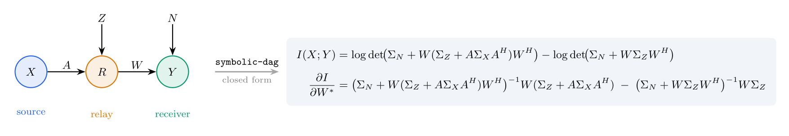

# symbolic-dag

[](LICENSE)
[](https://www.python.org/)

<p align="center">
  
</p>

<p align="center"><em>You describe the network; symbolic-dag returns the closed-form conditional MI and its Wirtinger gradient — derived symbolically, machine-verified against <a href="https://github.com/wadayama/cmi-dag"><code>cmi-dag</code></a>, and independent of the node dimension.</em></p>

Symbolic conditional mutual information, simplification, and **Wirtinger
differentiation** for multi-terminal linear Gaussian directed acyclic graphs
(DAGs). The symbolic sibling of the numerical library
[`cmi-dag`](https://github.com/wadayama/cmi-dag): the same multi-root
K-recursion and the same conditional MI

```
I(V_A; V_B | V_C) = log det Σ_{A|C} − log det Σ_{A|BC},
```

but the gains and covariances are kept as **opaque symbols**, so the result is a
closed form rather than a number. Where cmi-dag *evaluates* CMI and gradients,
symbolic-dag *derives* them — the conditional-independence proofs, the closed-form
Wirtinger gradients, and the stationarity (KKT) conditions that are usually worked
out by hand — and cross-checks every result against cmi-dag.

> numerics **discover**, symbolics **explain**.

A CMI is returned as a **lazy** object (a small set of log-determinant terms over
matrix intermediates), never as one expanded formula. Block determinants and
inverses are held symbolically and acted on only when asked: simplified by a
strategic rewrite engine, differentiated by a matrix/Wirtinger engine, or
evaluated numerically. Because the matrices stay opaque, the closed form is
**independent of the node dimension** — the scalar case is the `1×1`
specialisation of the same block-symbolic engine.

## Sister libraries

`symbolic-dag` is the symbolic member of the Gaussian-DAG family. Its numerical
siblings share the same K-recursion / Schur-complement / conditional-MI design.

| Library | Scope | When to use |
| --- | --- | --- |
| [`gaussian-dag`](https://github.com/wadayama/gaussian-dag) | Single-pair MI on deterministic linear Gaussian DAGs (numerical). | Single-link MIMO, multi-hop AF relay, diamond. |
| [`cmi-dag`](https://github.com/wadayama/cmi-dag) | Multi-root + conditional MI; rate regions; PGA optimization (numerical, PyTorch). | MAC, BC, IC, wiretap, multi-terminal rate regions. |
| **`symbolic-dag`** | **Symbolic CMI, simplification, Wirtinger gradients / KKT (SymPy).** | **Closed-form regime thresholds, d-separation proofs, optimal-precoder conditions; explaining what cmi-dag discovers.** |

> **Funding.** This work was supported by JST, CRONOS, Japan Grant Number **JPMJCS25N5**.

---

## Requirements

- Python ≥ 3.12
- SymPy, NumPy, and **PyTorch** (runtime dependencies). The symbolic engine is
  SymPy; the numerics and verification are PyTorch-oriented, aligned with the
  numerical sibling `cmi-dag`.
- [`uv`](https://docs.astral.sh/uv/) for environment management (recommended)

## Installation

```bash
git clone https://github.com/wadayama/symbolic-dag.git
cd symbolic-dag
uv sync                    # installs everything (sympy, numpy, torch) + dev (pytest)
```

This creates `.venv/` and installs all locked dependencies. Run any command via
`uv run python …` or `uv run pytest`. Confirm the install:

```bash
uv run pytest
```

A handful of cross-validation tests drive the actual `cmi-dag` library; they
require the `cmi-dag` repository to be available locally (a sibling checkout, or
`SYMBOLIC_DAG_CMIDAG_PATH`) and otherwise skip cleanly.

---

## Repository layout

```
symbolic-dag/
├── symbolic_dag/    core library (11 modules)
├── tests/           pytest suite (core + cmi-dag cross-validation)
├── examples/        runnable scripts
├── docs/            tutorial walkthrough
├── pyproject.toml   uv / hatchling project metadata
├── LICENSE          MIT
└── README.md        this file
```

---

## Quick start

### Build a CMI and prove conditional independence

The primary API mirrors `cmi-dag`'s index-based functional surface; gains and
covariances are `sympy` matrix expressions of a symbolic (or concrete) dimension.

```python
import sympy as sp
from symbolic_dag import (
    compute_k_blocks_multiroot,
    conditional_mutual_information_from_k,
    hermitian,
)

d = sp.Symbol("d", positive=True, integer=True)
A, B = sp.MatrixSymbol("A", d, d), sp.MatrixSymbol("B", d, d)
SX, SY, SZ = (hermitian(s, d) for s in ("Sigma_X", "Sigma_Y", "Sigma_Z"))

# chain X -> Y -> Z  (nodes 0, 1, 2)
K = compute_k_blocks_multiroot(
    num_nodes=3, roots=[0], parents={1: [0], 2: [1]},
    edge_mats={(1, 0): A, (2, 1): B},
    root_covs={0: SX}, noise_covs={1: SY, 2: SZ},
)

I = conditional_mutual_information_from_k(K, A=[0], B=[2], C=[1])   # I(X;Z|Y)
print(I.is_conditionally_independent())   # True — proved symbolically, any dimension
```

The proof is a **matrix identity**: the rewrite engine reduces the cross
conditional covariance `Σ_{XZ|Y}` to the zero matrix, so `I(X;Z|Y) = 0` for every
dimension at once.

### Derive a closed-form precoder gradient (cross-checked with cmi-dag)

For the precoder gadget `Y = (H F) X0 + X1 + N`, the gradient of `I(X0; Y | X1)`
with respect to the precoder `F` is derived symbolically:

```python
import sympy as sp
from symbolic_dag import (
    compute_k_blocks_multiroot,
    conditional_mutual_information_from_k,
    hermitian,
)

d = sp.Symbol("d", positive=True, integer=True)
H, F = sp.MatrixSymbol("H", d, d), sp.MatrixSymbol("F", d, d)
S0, R = hermitian("Sigma_0", d), hermitian("R", d)

K = compute_k_blocks_multiroot(
    num_nodes=3, roots=[0, 1], parents={2: [0, 1]},
    edge_mats={(2, 0): H * F, (2, 1): sp.Identity(d)},
    root_covs={0: S0, 1: sp.Identity(d)}, noise_covs={2: R},
)
I = conditional_mutual_information_from_k(K, A=[0], B=[2], C=[1])

print(I.wirtinger_grad(F))
#   Adjoint(H)*(R + H*F*Sigma_0*Adjoint(F)*Adjoint(H))**(-1)*H*F*Sigma_0
print(I.stationarity(F))     # the optimal-precoder condition  dI/dF* = 0
```

PyTorch / cmi-dag autograd returns exactly twice this gradient (its Wirtinger
convention); `examples/precoder_gradient.py` checks the match to ~1e-14.

---

## Public API

All symbols below are re-exported from the top-level package.

| Symbol | Module | Purpose |
| --- | --- | --- |
| `compute_k_blocks_multiroot(num_nodes, roots, parents, edge_mats, root_covs, noise_covs, *, cross_root_covs=None, symmetrize_self_blocks=True)` | `krecursion` | Symbolic multi-root K-recursion. Same signature/conventions as cmi-dag; `edge_mats`/covariances are `sympy` matrix expressions. Returns the canonical block dict `K[(j,k)]` (`j ≥ k`). |
| `conditional_mutual_information_from_k(K, A, B, C=())` | `information` | `I(V_A; V_B \| V_C)` as a lazy `SymbolicCMI`. Numeric value agrees with cmi-dag exactly (complex, no ½). |
| `conditional_covariance(K, U, C)` | `information` | Schur-complement conditional covariance `Σ_{U\|C}` (block-assembled). |
| `mmse_error_covariance(K, target, observations)` | `information` | LMMSE estimation-error covariance `Σ_{target\|observations}` (single target node, block-free). Its `tr` is the scalar MMSE; differentiate with `trace_grad`. |
| `lmmse_estimator(K, target, observations)` | `information` | Closed-form Wiener filter `W = Σ_{target,obs}·Σ_{obs,obs}⁻¹` — the MMSE KKT solution; residual is `mmse_error_covariance`. |
| `SymbolicCMI` | `expr` | Lazy CMI: signed log-det terms + cross conditional covariance. Methods `.simplify(strategy)`, `.is_conditionally_independent()`, `.wirtinger_grad(var)`, `.stationarity(var)`, `.to_expr()`; numerical checks `.check(dim)`, `.check_gradient(var, dim)`, `.torch_value(subs, dim)` (PyTorch), and `.evaluate(subs)` / `.numeric_check(subs, ref)` (NumPy). |
| `to_torch(expr, subs, dim)` / `random_torch_point(cmi, dim)` | `verify` | Lower a symbolic matrix expression to a differentiable `torch` tensor; draw a random complex point (covariances Hermitian PD). |
| `hermitian(name, d)` | `assumptions` | Create a `d×d` Hermitian PD covariance symbol (a `HermitianMatrix`). The engines recognise it and apply `Adjoint(Σ) → Σ`. |
| `GaussianDAG` | `builder` | Thin named-node builder (`add_source`, `add_node`, `cmi`); lowers to the functional core. |
| `simplify_expr(e, strategy="normalize")` / `proves_zero(e)` | `rewrite` | The strategic rewrite engine: `"normalize"` (structural) or `"capacity"` (with low-rank expansion); `proves_zero` is the d-separation check. |
| `wirtinger_grad_logdet(M, F, dF)` / `wirtinger_grad_cmi(cmi, F)` | `matderiv` | The matrix/Wirtinger differentiation engine for CMI (arbitrary `A`, `B`, `C`; both-multi-node via the MI chain rule). |
| `trace_grad(M, var)` / `wirtinger_grad_trace(M, F, dF)` | `matderiv` | Closed-form Wirtinger gradient of a **trace objective** `d(tr M)/dvar*` — e.g. an MMSE design `tr(Σ_{X\|Y})`. Autograd returns `2×`. |
| `solve_stationary(equation, var)` | `solve` | Solve a **linear** matrix stationarity (KKT) equation `equation = 0` for `var` (right-/left-linear, single two-sided term) — e.g. the MMSE/Wiener KKT. Nonlinear (capacity) equations raise. |
| `cmi_to_latex(cmi)` / `report(cmi, var)` (and `SymbolicCMI.to_latex` / `.report`) | `latex` | LaTeX hand-off: the CMI (structural or expanded), the gradient, and the KKT condition. |
| `numpy_cmi(K, A, B, C)` / `numpy_k_blocks(...)` | `numeric` | An independent NumPy CMI oracle for verification. |

### Conventions

- **Complex / Wirtinger.** All matrices are complex; covariances are Hermitian
  PD (declare with `hermitian`). `^H` is `sympy.Adjoint`. The CMI carries **no
  factor of ½** (circular-complex convention, matching cmi-dag). The Wirtinger
  gradient produced here is `∂I/∂F*`; a numerical library's autograd returns
  `2·∂I/∂F*`.
- **Lazy form.** `SymbolicCMI` is a set of signed `log det(·)` terms over matrix
  intermediates, never an expanded formula. Call `.simplify`, `.wirtinger_grad`,
  `.evaluate` to act on it.
- **Hermitian assumption.** `sympy` does not know a covariance is Hermitian; the
  `hermitian` tag lets the engines apply `Adjoint(Σ) → Σ`, which is what makes
  conditional independence *provable* (otherwise the cross block keeps `Σ^H`
  terms and cannot be recognised as zero).
- **Strategy matters.** The rewrite rules are not confluent as a flat set;
  structural normalization must run before low-rank expansion. The strategies
  (`"normalize"`, `"capacity"`) encode this phasing.
- **Indexing.** Roots are the prefix `{0, …, K-1}`; only canonical blocks
  `K[(j,k)]` with `j ≥ k` are stored (`get_K` applies the Hermitian flip). Same
  as cmi-dag.
- **Units.** All MI values are in **nats**.

---

## How it works: build → simplify → answer

- **build** — `krecursion.py` constructs the covariance blocks and the
  conditional-covariance Schur complements; `information.py` / `expr.py` return
  the CMI as a lazy set of log-det terms.
- **simplify** — `sympy.simplify` cannot handle the matrix layer. The strategic
  rewrite engine (`rewrite.py`) supplies it: structural normalization (symmetry,
  inverse-cancellation) proves conditional independence; an expansion phase
  (Schur, Sylvester, determinant-lemma, Woodbury) reshapes log-dets toward the
  capacity form.
- **differentiate** — `sympy`'s native matrix differentiation fails (returns the
  zero matrix), so `matderiv.py` derives the gradient via
  `d log det M = tr(M⁻¹ dM)` and trace cyclicity.

---

## Verification

### Check your own results (PyTorch, one call)

Any `SymbolicCMI` can be numerically checked at random complex points — in
PyTorch, aligned with the numerical sibling `cmi-dag`:

```python
I.check(dim=3)              # CMI value vs an independent Schur-complement path
#   {'passed': True, 'max_abs_err': 1.8e-14, 'samples': 4}
I.check_gradient(F, dim=3)  # closed-form gradient vs PyTorch autograd (autograd == 2·grad)
#   {'passed': True, 'max_abs_err': 2.5e-14}
```

Under the hood, `to_torch` lowers the symbolic CMI to a **differentiable** torch
scalar, so `I.torch_value(subs, dim)` plugs into your own numerical experiments
and autograd. (An independent torch-free NumPy oracle, `numpy_cmi`, is used
internally as an extra cross-check.)

### The test suite

```bash
uv run pytest        # full suite: symbolic + PyTorch verification + cmi-dag cross-checks
```

Every symbolic result is checked against an independent computation; the headline
tests additionally cross-check against the **actual `cmi-dag` library** — its
numerical CMI and PyTorch autograd — on random complex points across dimensions
(these skip if the `cmi-dag` repository is not available locally).
The cmi-dag CMI value matches to ~1e-10; the symbolic Wirtinger gradient matches
autograd (up to its convention factor of 2) to ~1e-9; and the symbolic
d-separation proof agrees with cmi-dag's numerical `I ≈ 0`.

---

## Tutorials

A four-part walkthrough is available under [`docs/`](docs/README.md):

1. [Installation and your first symbolic CMI](docs/tutorial-1-installation-and-first-cmi.md)
2. [Proving conditional independence (the rewrite engine)](docs/tutorial-2-proving-conditional-independence.md)
3. [Closed-form Wirtinger gradients and KKT](docs/tutorial-3-wirtinger-gradients-and-kkt.md)
4. [The builder and cross-validation against cmi-dag](docs/tutorial-4-builder-and-cmidag-crosscheck.md)

---

## Examples

| Command | What it demonstrates |
| --- | --- |
| `uv run python examples/gadgets.py` | chain / fork / collider: d-separation proved symbolically, the lazy CMI log-det terms. |
| `uv run python examples/mac_cmi.py` | multi-node MAC CMI `I(X0,X1; Y)`; the chain rule; one-call PyTorch value check. |
| `uv run python examples/precoder_gradient.py` | closed-form Wirtinger gradient / KKT of a MIMO precoder, checked against PyTorch autograd. |

See [`examples/README.md`](examples/README.md).

---

## Known limitations (this milestone)

- **Scope.** *Linear Gaussian* DAGs only; complex (Wirtinger). The library's
  responsibility is the **closed-form CMI and its Wirtinger gradient / KKT
  condition**, handed off via LaTeX (`to_latex`, `report`); the problem-specific
  regime / optimal-structure analysis is intentionally left to the analyst.
  Automated regime-map / threshold solving is out of scope.
- **KKT solving.** `solve_stationary` solves *linear* stationarity equations in
  closed form (the MMSE / Wiener case). A capacity stationarity `dI/dF* = 0` is
  nonlinear (`F` sits inside an inverse) and is not solved — it needs an
  eigen-ansatz / water-filling argument, which stays with the analyst.
- **Gradients.** The Wirtinger gradient handles arbitrary `A`, `B`, `C` — single-
  or multi-node, via sequential single-node conditioning and (when both `A` and
  `B` are multi-node) the mutual-information chain rule — for log-det (CMI) and
  trace (MMSE) objectives.
- **Expression growth.** Conditioning on large sets forms a symbolic matrix
  inverse, whose expanded form grows quickly; keep results lazy.
- **Positive-definiteness.** Conditional covariances must be Hermitian PD for the
  log-dets; numerical checks must supply Hermitian PD matrices.

---

## Citation

```bibtex
@software{wadayama_symbolic_dag,
  author  = {Wadayama, Tadashi},
  title   = {{symbolic-dag}: symbolic conditional mutual information,
             simplification and {W}irtinger differentiation on linear
             {G}aussian {DAG}s},
  year    = {2026},
  version = {0.1.0},
  url     = {https://github.com/wadayama/symbolic-dag},
}
```

### Acknowledgement

This work was supported by JST, CRONOS, Japan Grant Number JPMJCS25N5.

---

## License

`symbolic-dag` is released under the [MIT License](LICENSE).
